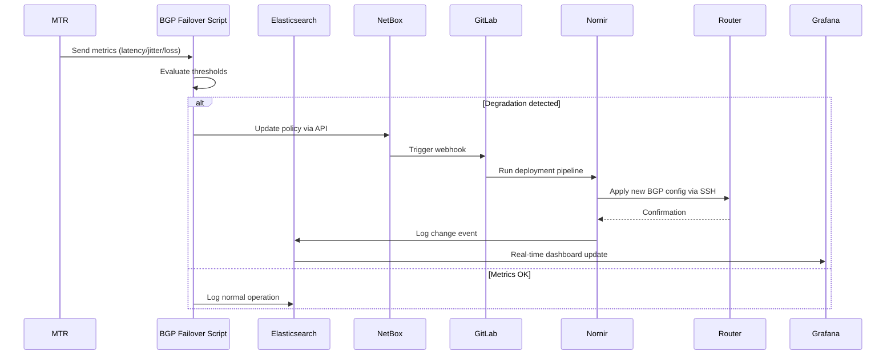

# 🚀 Containerlab Laboratory: BGP Route Selection Based on Latency — An Intelligent Failover Engine Optimized with Supervised Learning

> A simulated ISP network environment with automated BGP policy failover based on real-time link quality metrics.

[](https://containerlab.dev/)

---

## 📋 Summary

This laboratory simulates an Internet Service Provider (ISP) network environment with two redundant WAN uplinks (**Provider1** and **Provider2**), used to design, test, and validate an intelligent BGP failover mechanism driven by continuous latency, jitter, and packet loss measurements — rather than static, manually configured routing policies.

The repository deploys and integrates:

- **A continuous monitoring and BGP failover framework** — orchestrates active measurements (MTR) toward the upstream peer and two DNS reference targets, computes a weighted health score per cycle, and automatically decides when to fail over to the standby provider or return to the primary one.
- **A supervised learning framework** — derives time-windowed statistical features (z-score, coefficient of variation, p95 deviation, trend/velocity/acceleration) from the historical metrics, and trains XGBoost and Logistic Regression models to estimate the relative importance of each metric and propose data-driven weights for the scoring formula.
- **TimescaleDB** — the time-series datastore for raw metrics, derived features, and failover event history, with **pgAdmin** for inspection.
- **Supporting scripts** for synthetic dataset generation, calibrated against real-world ISP operating parameters, to complement the historical data captured directly from the lab topology.

---

## 🏗️ Proposed Solution Architecture

| Component | Role | Key Feature |
|---|---|---|
| Containerlab topology | Virtualized ISP network: core router, transit router, two upstream providers, and two DNS targets (via Google/Cloudflare-style resolvers) | Reproducible, redundant dual-uplink topology on a Nokia SR Linux core |
| `nornir` (monitor node) | Runs the failover engine and captures live measurements | Executes MTR toward the peer and both DNS targets every cycle |
| `ianetops` (automation node) | Runs the feature engineering and model training pipeline | Independent of the live failover decision loop |
| TimescaleDB | Central time-series datastore | Hypertables for `bgp_metrics_new`, `bgp_failover_events`, `ml_features` |
| `bgp_failover_engine_new.py` | Failover engine | Weighted scoring, sustained-degradation confirmation, individual-metric breach detection, safety bypass |
| `timescaledb_client.py` | Database access layer | Dynamic, schema-agnostic inserts; sanitizes numpy/NaN types |
| `feature_engine_incremental.py` | Feature derivation | Rolling-window statistical features (Etapa 1 + Etapa 2); incremental with cold-start support |
| `synthetic_data_generator.py` | Synthetic dataset generator | Reuses the real engine's decision logic; five calibrated anomaly waveforms (step, spike, unstable, oscillating, slow-increase) |
| `xgboost_optimizer.py` / `logistic_regression_optimizer.py` | Model training | Feature importance ranking (XGBoost) and interpretable linear coefficients (Logistic Regression) |
| `train_from_ml_features.py` / `train_logistic_regression.py` | Training orchestration | Cross-validated evaluation, candidate weight extraction |

---

## Repository Structure

```
.
├── bgp-auto.yml                     # Containerlab topology definition
├── docker-compose.yml               # TimescaleDB + pgAdmin
├── create_database_schema.sql       # Full DB schema (tables, roles, permissions)
├── configs/nornir/automation/timescaledb_client.py            # DB access layer
├── bgp_failover_engine_new.py       # Failover engine
├── feature_engine_incremental.py    # Feature derivation (Etapa 1 + Etapa 2)
├── synthetic_data_generator.py      # Synthetic dataset generator
├── xgboost_optimizer.py             # XGBoost training/optimization
├── logistic_regression_optimizer.py # Logistic Regression training/optimization
├── train_from_ml_features.py        # XGBoost training entry point
└── train_logistic_regression.py     # Combined XGBoost + Logistic Regression comparison
```

---

## 🗺️ Laboratory Architecture


### 🔍 Architecture Highlights:
- **Dual WAN Uplinks**: Provider1 & Provider2 with independent BGP sessions
- **Core Router**: Huawei device managed via SSH through Nornir
- **Automation Plane**: NetBox → GitLab CI/CD → Nornir → Router
- **Telemetry Plane**: MTR → BGP Failover Script → Elasticsearch → Grafana

---

## 🔄 BGP Failover Workflow

### Workflow Steps:
1. 📊 **Monitor**: MTR continuously probes BGP peers for latency, jitter, and packet loss
2. ⚙️ **Evaluate**: BGP Failover Script analyzes metrics against defined thresholds
3. 🎯 **Decision**: If degradation detected → trigger policy update via webhook
4. 🚀 **Execute**: GitLab CI/CD pipeline activates → Nornir pushes new config to Huawei router
5. ✅ **Validate**: Post-change verification + telemetry update in Elasticsearch
6. 📈 **Visualize**: Grafana dashboard reflects new active provider and link status


## ⚙️ Automation Framework Configuration (Detailed)

### 1. NetBox Node

- Install NetBox container following:
  https://github.com/netbox-community/netbox-docker/wiki/Using-Netbox-Plugins

- Install BGP plugin:
  https://github.com/netbox-community/netbox-bgp.git

- Deploy NetBox:
```bash
docker compose up -d
```
- Generate a secure API token
- Configure core objects:
  - Sites
  - Platforms
  - Manufacturers
  - Devices
  - Interfaces
- Configure BGP objects:
  - Communities
  - Prefix List Rules
  - Routing Policy Rules
  - Sessions
- Define custom fields:
  - local_asn
  - as_path_prepend_count
  - local_preference
- Connect NetBox to Containerlab topology:
```bash
docker network connect isp-bgp netbox-docker-netbox-1
```
### 2. GitLab CI/CD (Secure Automation Pipeline)
- Create a GitLab repository
- Configure .gitlab-ci.yml:
  - Stages: deploy
  - Variables: NetBox URL, NetBox Token
  - Script: apply_bgp_policies.py
- Configure Nornir inventories:
  - defaults.yaml
  - groups.yaml
  - hosts.yaml
- Configure nornir-config.yml:
  - Inventory paths
  - Connection options
- Implement Python automation script:
  - apply_bgp_policies.py
- Example configuration files available at: /configs/nornir/automation
- Create Pipeline Trigger Token (for secure pipeline execution via NetBox webhooks)
- Create Project Runner (required for automation job execution):
  - Tags: nornir, production
### 3. Nornir Node
- Register GitLab Runner in nornir node:
```bash
gitlab-runner register \
  --url "https://gitlab.com/" \
  --registration-token "YOUR_PROJECT_RUNNER_TOKEN" \
  --description "Nornir Production Runner" \
  --tag-list "nornir, production" \
  --executor "shell"
```
## 📡 BGP Failover Script Functionality
### Monitoring Tool
- MTR (My Traceroute)
- Protocol: IPv4 / IPv6
- Output format: JSON (for automated parsing)
### 📏 Measurements and Scoring
- Measurement Points
  - BGP Peer → Direct latency to router
  - Public DNS → Hop-by-hop latency
### Collected Metrics
| Metric | value | 
|-----------|------|
| Average Latency | (ms) | 
| Jitter / Variability | (Standard Deviation) | 
| Packet Loss | (%) |
### Measurement Parameters
| Parameter | value | 
|-----------|------|
| Cycle interval | 30 seconds | 
| Packets per cycle | 5 | 
| Packet size | 64 bytes |
| Packet interval | 0.5 seconds |
| Timeout | 30 seconds |
### 🧮 Weighted Scoring System
- Score = Weighted_Latency + Loss_Penalty + Jitter_Penalty. Where...
  - Weighted_Latency = (Peer × 70%) + (DNS × 30%)
  - Loss_Penalty = (Peer_Loss% + DNS_Loss%) × 100
  - Jitter_Penalty = (Peer_StDev + DNS_StDev) × 0.5
### 📊 Decision Logic
- Lower score = Better link quality
#### Configurable Thresholds
| Metric | Warning | Critical |
|-----------|------|----------|
| Peer Latency | 12 ms | 25 ms |
| DNS Latency | 20 ms | 50 ms |
| Packet Loss | 0% | 20% (immediate failover) |
| Switching Margin | - | 3 points |
### 🔁 Failover Actions
#### Primary Provider
- AS Path Prepend: 0 (preferred path)
- Local Preference: 200 (high priority)
#### Backup Provider
- AS Path Prepend: 3 (less preferred path)
- Local Preference: 100 (low priority)
#### ⚡ Execution
- Policy updates via NetBox API (routing policies)
- Fully automated execution (no manual intervention)
## 🚀 Topology Deployment and Node Access
### Deploy the lab
```bash
clab deploy -t bgp-auto.yml
```
### Access Nornir node
```bash
docker exec -it clab-lab-isp-automation-nornir /bin/bash
```
#### Register GitLab Runner
- (Execute inside nornir node if not already configured)
#### Run BGP Failover Script
```bash
cd /root/automation
python3 bgp_failover_telemetry_u.py
```
#### Access Grafana Dashboard
- Open in your browser:
```bash
http://<local-server-ip>:3000
```  
## 📄 License

This project is licensed under the terms of the [MIT](LICENSE).
