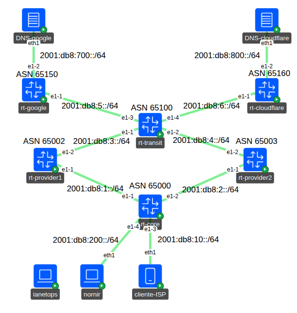

# 🚀 Containerlab Laboratory: BGP Route Selection Based on Latency — An Intelligent Failover Engine Optimized with Supervised Learning

> A simulated ISP network environment with automated BGP policy failover based on latency.

[](https://containerlab.dev/)

---

## 📋 Summary

This laboratory simulates an Internet Service Provider (ISP) network environment with two redundant WAN uplinks (**Provider1** and **Provider2**), used to design, test, and validate an intelligent BGP failover mechanism driven by continuous latency, jitter, and packet loss measurements — rather than static, manually configured routing policies.

The repository deploys and integrates:

- **A continuous monitoring and BGP failover framework** — orchestrates active measurements (MTR) toward the upstream peer and two DNS reference targets, computes a weighted health score per cycle, and automatically decides when to fail over to the standby provider or return to the primary one.
- **A supervised learning framework** — derives time-windowed statistical features (z-score, coefficient of variation, p95 deviation, trend/velocity/acceleration) from the historical metrics, and trains XGBoost and Logistic Regression models to estimate the relative importance of each metric and propose data-driven weights for the scoring formula.
- **TimescaleDB** — the time-series datastore for raw metrics, derived features, and failover event history, with **pgAdmin** for inspection.
- **Supporting scripts** for synthetic dataset generation, calibrated against real-world ISP operating parameters, to complement the historical data captured directly from the lab topology.

---

## 🏗️ Proposed Solution Architecture

| Component | Role | Key Feature |
|---|---|---|
| Containerlab topology | Virtualized ISP network: core router, transit router, two upstream providers, and two DNS targets (via Google/Cloudflare-style resolvers) | Reproducible, redundant dual-uplink topology on a Nokia SR Linux core |
| `nornir` (monitor node) | Runs the failover engine and captures live measurements | Executes MTR toward the peer and both DNS targets every cycle |
| `ianetops` (automation node) | Runs the feature engineering and model training pipeline | Independent of the live failover decision loop |
| TimescaleDB | Central time-series datastore | Hypertables for `bgp_metrics_new`, `bgp_failover_events`, `ml_features` |
| `bgp_failover_engine_new.py` | Failover engine | Weighted scoring, sustained-degradation confirmation, individual-metric breach detection, safety bypass |
| `timescaledb_client.py` | Database access layer | Dynamic, schema-agnostic inserts; sanitizes numpy/NaN types |
| `feature_engine_incremental.py` | Feature derivation | Rolling-window statistical features (Etapa 1 + Etapa 2); incremental with cold-start support |
| `synthetic_data_generator.py` | Synthetic dataset generator | Reuses the real engine's decision logic; five calibrated anomaly waveforms (step, spike, unstable, oscillating, slow-increase) |
| `xgboost_optimizer.py` / `logistic_regression_optimizer.py` | Model training | Feature importance ranking (XGBoost) and interpretable linear coefficients (Logistic Regression) |
| `train_from_ml_features.py` / `train_logistic_regression.py` | Training orchestration | Cross-validated evaluation, candidate weight extraction |

---

## Repository Structure

```
.
├── bgp-auto.yml                                               # Containerlab topology definition
├── docker-compose.yml                                         # TimescaleDB + pgAdmin
├── create_database_schema.sql                                 # Full DB schema (tables, roles, permissions)
├── configs/nornir/automation/
                              ├── timescaledb_client.py        # DB access layer
                              ├── bgp_failover_engine_new.py   # Failover engine
                              ├── synthetic_data_generator.py  # Synthetic dataset generator
├── scripts/
            ├── feature_engine_incremental.py                  # Feature derivation (Etapa 1 + Etapa 2)
            ├── xgboost_optimizer.py                           # XGBoost training/optimization
            ├── logistic_regression_optimizer.py               # Logistic Regression training/optimization
            ├── train_from_ml_features.py                      # XGBoost training entry point
            └── train_logistic_regression.py                   # Combined XGBoost + Logistic Regression comparison
```

---

## 🗺️ Laboratory Architecture



### 🔍 Architecture Highlights:
- **Dual WAN Uplinks**: Provider1 & Provider2 with independent BGP sessions
- **Core Router**: Nokia SR Linux 24.10 device 
- **Capture and Datastore Plane**: MTR → BGP Failover Script → Timescaledb
- **IA ML Plane**: ianetops
---
## Prerequisites

- Docker and Docker Compose
- [Containerlab](https://containerlab.dev/)
- Python 3.10+ with `psycopg2`, `pandas`, `numpy`, `xgboost`, `scikit-learn`, `optuna`
- `mtr` installed inside the monitor node's container image
- (Optional) [Containerlab extension for Visual Studio Code](https://containerlab.dev/manual/gui/), used to simulate link degradation interactively

---

## Topology Deployment and Node Access

### 1. Deploy TimescaleDB and pgAdmin

TimescaleDB and pgAdmin run as an independent Docker Compose stack on the host, so their data persists across `containerlab destroy`/`deploy` cycles.

```bash
sudo mkdir -p /opt/timescaledb/data /opt/pgadmin/data
sudo chown -R 5050:5050 /opt/pgadmin/data
docker compose up -d
```

### 2. Create the database schema

```bash
psql -h localhost -U postgres -d bgp_failover_db -f create_database_schema.sql
# password: POSTGRES_PASSWORD from docker-compose.yml ("password")
```

This creates the `bgp_app` role, enables the TimescaleDB extension, and creates the four required tables (`provider_config`, `bgp_metrics_new`, `bgp_failover_events`, `ml_features`). Adjust the `peer_ip`/`peer_asn` values in `provider_config` to match your topology's addressing before starting the engine.

### 3. Deploy the Containerlab topology

```bash
clab deploy -t bgp-auto.yml
```

### 4. Access the monitor node and capture metrics

```bash
docker exec -it clab-bgp-lab-nornir /bin/bash
cd /root/automation
python3 bgp_failover_engine_new.py
```

This continuously measures the peer and both DNS targets, computes the scoring, and stores every cycle in `bgp_metrics_new` (and any provider switch in `bgp_failover_events`).

### 5. Simulating link degradation

To exercise the failover logic, inject latency/loss on the relevant links using the [Containerlab VS Code extension](https://marketplace.visualstudio.com/items?itemName=srl-labs.vscode-containerlab) (or `tc qdisc netem` directly on the corresponding interfaces) while the engine is running.

### 6. Derive features for model training

```bash
docker exec -it clab-bgp-lab-ianetops /bin/bash
cd /root/automation
python3 feature_engine_incremental.py
```

Reads the accumulated history from `bgp_metrics_new` and populates `ml_features` with the derived rolling-window statistics and the training target.

### 7. Generate synthetic data (optional, for large-scale training)

Real captures from a lab session are typically too short to yield enough failover/return events for robust training. To complement them, clean the TimescaleDB tables and run the synthetic generator, which reuses the real engine's decision logic instead of hand-rolling a separate formula:

```bash
# Lab scale (high frequency, 3-cycle confirmation window — fast pipeline iteration)
python3 synthetic_data_generator.py --scale lab --cycles 300

# Realistic scale (calibrated against actual ISP operating parameters)
python3 synthetic_data_generator.py --scale realistic --cycles 100000

# Manually tunable calibration parameters
python3 synthetic_data_generator.py --scale realistic --cycles 50000 \
    --events-per-week 2.5 --peak-hour-start 19 --peak-hour-duration 4 \
    --confirmation-cycles 20
```

Re-run step 6 (`feature_engine_incremental.py`) afterward to derive features from the newly generated data.

### 8. Train the model

```bash
python3 train_from_ml_features.py
```

Runs Bayesian hyperparameter optimization and 5-fold cross-validation on XGBoost, reporting feature importance and candidate scoring weights. Use `train_logistic_regression.py` to additionally train Logistic Regression and compare both sets of candidate weights side by side against the current formula.

---
## References

- IETF Draft, *BGP Performance-aware Routing Mechanism*
- Databricks Engineering Blog, *Detecting Anomalies in Network Latency Time Series: From Statistical Filters to Machine Learning*
- FCC broadband measurement methodology, *Where Has the Time Gone? Examining Over a Decade of Broadband Latency Measurements*

This work was developed as part of a technical presentation on AI-driven Network Operations (AI-NetOps) applied to BGP failover automation.
This project is licensed under the terms of the [MIT](LICENSE).
